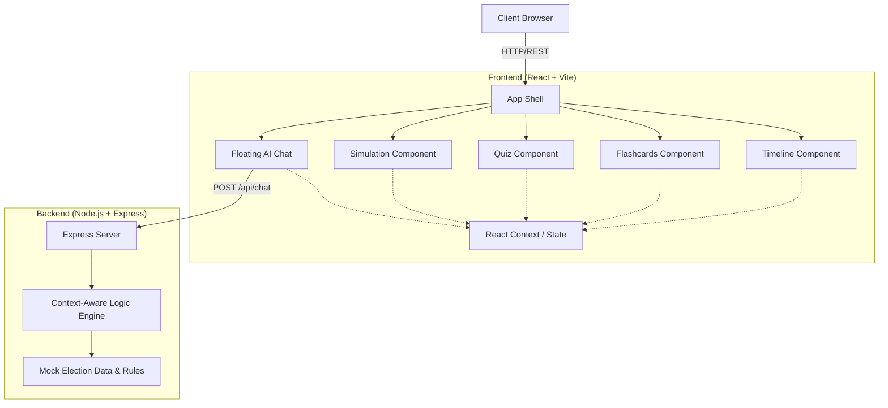
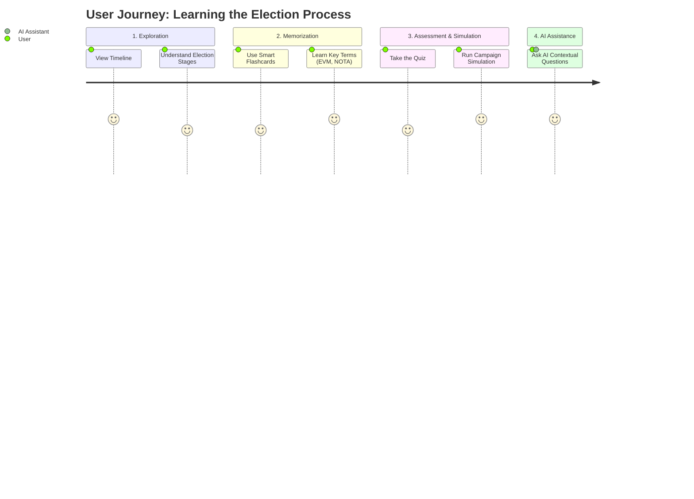

# Indian Election Explorer

Welcome to the **Indian Election Explorer**! This project is an interactive, intelligent guide designed to help users understand the world's largest democratic exercise—the Indian Election process. 

Our application serves as a comprehensive educational platform that demystifies complex electoral procedures through visual learning, gamification, and AI-driven assistance. Whether you are a first-time voter, a student of political science, or just a curious citizen, this platform provides an intuitive and engaging way to explore how democracy functions in India.


## 🏆 The Challenge

The challenge was to develop an interactive, user-friendly election guidance assistant and deploy it on Google Cloud Platform. The goal was to transform a legacy structure into a world-class, premium web application with a modern design using Tailwind CSS and Framer Motion. 

Key objectives included:
- Clarifying election processes and timelines through a guided, step-by-step experience.
- Implementing advanced interactive features such as gamification and simulations.
- Maintaining a professional, intuitive, and "official" UI/UX aesthetic that ensures high engagement and ease of use.
- Integrating an AI-powered assistant to provide context-aware help to users.

## 🚀 What We Built

To meet the challenge, we built a comprehensive, responsive React application with a robust Node.js/Express backend. 

### Key Features:
- **Interactive Timeline**: A step-by-step visual guide detailing the stages of the Indian election process, from the initial notification to the counting of votes.
- **Smart Flashcards**: A learning tool designed to help users memorize important election terminology (like EVM, VVPAT, NOTA) with ease.
- **Gamified Quiz System**: Test your knowledge of election facts with an engaging quiz component.
- **Election Simulation Engine**: Step into the shoes of a campaign manager and balance high-reach methods with high-conversion strategies to manage your budget and win elections.
- **AI-Powered Context-Aware Assistant**: A floating chat interface that provides instant, contextual answers based on the section of the app you are currently exploring.

## 📊 System Architecture & Diagrams

### High-Level Architecture
The application follows a modern client-server architecture with a React frontend communicating with an Express.js backend.



### User Journey Flow
Here is how a typical user interacts with the platform:



## 💻 Technology Stack
- **Frontend**: React (Vite), Tailwind CSS, Framer Motion, Lucide React
- **Backend**: Node.js, Express.js
- **Tools**: Concurrently (to run both client and server seamlessly)
- **Deployment**: Docker, Google Cloud Run

## 🛠️ How to Run the App Locally

Follow these step-by-step instructions to get the application up and running on your local machine:

### Prerequisites
Make sure you have [Node.js](https://nodejs.org/) installed on your machine.

### Step 1: Navigate to the Project Directory
Open your terminal and navigate to the root directory of the project:
```bash
cd elec
```

### Step 2: Install Dependencies
Run the following command to install all required frontend and backend dependencies:
```bash
npm install
```

### Step 3: Start the Development Servers
The project is configured to run both the Vite development server (frontend) and the Express server (backend) concurrently. Start them by running:
```bash
npm run dev
```

### Step 4: Open the App
Once the servers start successfully, the terminal will display a local URL (usually `http://localhost:5173`). Open this URL in your web browser to interact with the Indian Election Explorer!

*Note: The backend API runs on port 8080 by default.*

## ☁️ How to Deploy to Google Cloud Run

Follow these instructions to deploy the application from scratch to Google Cloud Run:

### Step 1: Clone the Repository
Clone the project to your local machine:
```bash
git clone https://github.com/pooja-bhavani/Indian-Election-Explorer.git
cd Indian-Election-Explorer
```

### Step 2: Install Google Cloud CLI
Make sure you have the [Google Cloud CLI (`gcloud`)](https://cloud.google.com/sdk/docs/install) installed. On macOS with Homebrew, you can run:
```bash
brew install --cask google-cloud-sdk
```

### Step 3: Authenticate and Set the Project
Login to your Google Cloud account and set your active project:
```bash
gcloud auth login
gcloud config set project [YOUR_PROJECT_ID]
```
*(Replace `[YOUR_PROJECT_ID]` with your actual Google Cloud Project ID, for example: `election-project-494720`)*

### Step 4: Deploy the Application
Deploy the application directly from the source code. Cloud Run will automatically build the Docker container and deploy it:
```bash
gcloud run deploy elec --source . --region us-central1 --allow-unauthenticated
```
- `--source .`: Uses the `Dockerfile` in the root directory to build the app.
- `--region`: Sets the deployment region (e.g., `us-central1`).
- `--allow-unauthenticated`: Makes the application accessible to the public.


Once the deployment finishes, the terminal will provide a live URL where your application is hosted!
